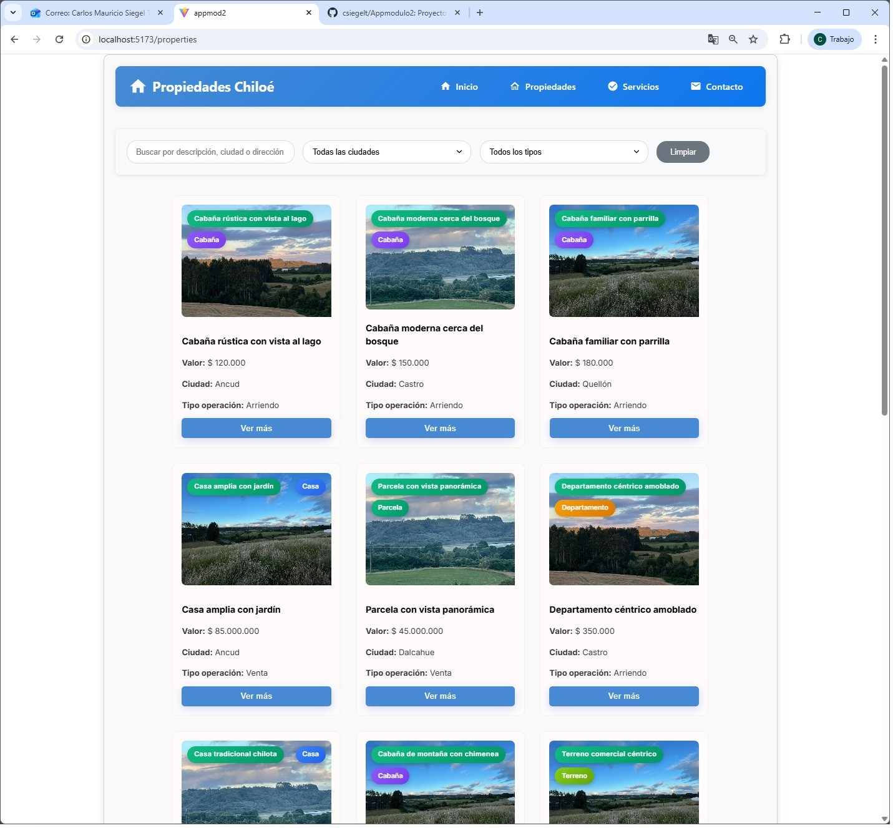
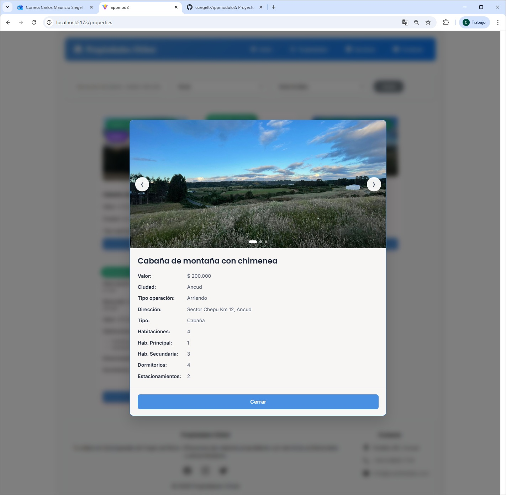
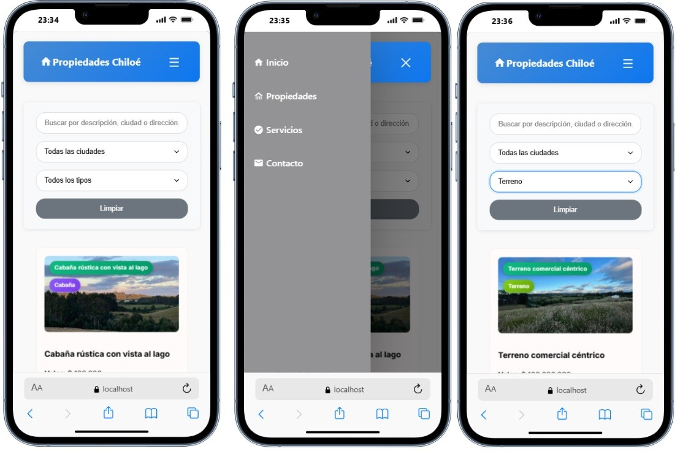
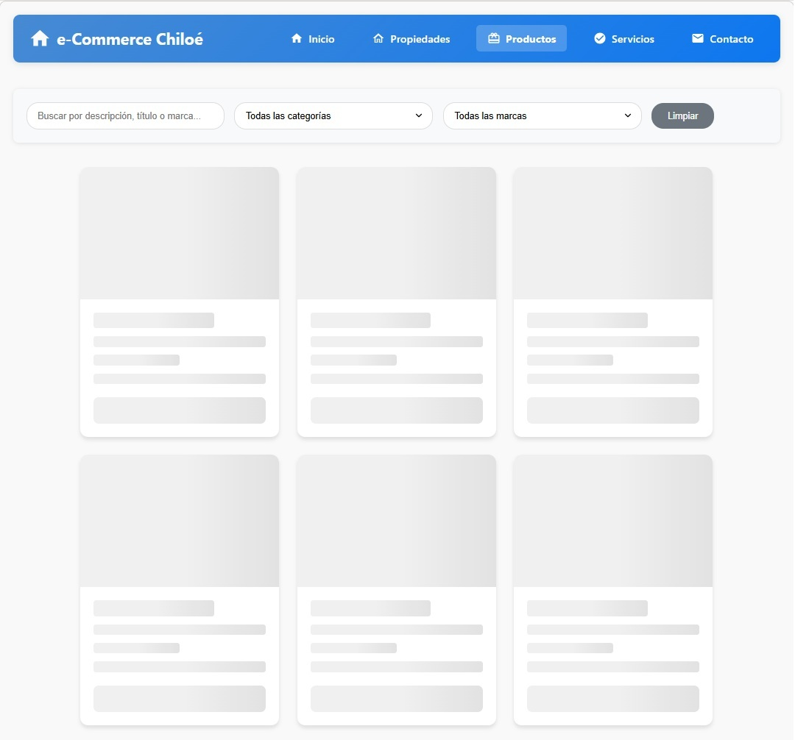

# AppModulo2 - Portal Inmobiliario y Tienda de Productos

## Descripción

Plataforma web dual que integra:
1. **Portal Inmobiliario** enfocado en propiedades de la Isla de Chiloé, Chile
2. **Tienda de Productos** con catálogo completo conectado a API externa

El sistema permite visualizar, filtrar y navegar entre propiedades inmobiliarias y productos de diversas categorías, con un sistema de filtrado dinámico, paginación, visualización de tarjetas con información detallada y **cálculos automáticos de precios y volúmenes**.

---

## Componentes Creados

### 1. **Card** (`src/components/card/Card.jsx`)
- Tarjeta 3D con efecto flip al hacer clic
- **Dual mode**: Soporta propiedades inmobiliarias y productos
- Vista frontal: imagen, descripción, precio y características básicas
- Vista trasera: información detallada según tipo (propiedad/producto)
- Integración con modal para galería de imágenes
- Componentes separados para detalles:
  - `ProductDetailsCard.jsx` - Detalles de productos
  - `PropertyDetailsCard.jsx` - Detalles de propiedades
- **Cálculos automáticos**:
  - Precio con descuento aplicado (% de descuento)
  - Volumen en cm³ calculado desde dimensiones
- Etiquetas de estado dinámicas
- Diseño responsive adaptativo
- **Constantes**: `Card.constants.js` para labels de botones

### 2. **ButtonCard** (`src/components/button/ButtonCard.jsx`)
- Componente de botón reutilizable
- Variante `primario`: gradiente azul para acciones principales
- Variante `secundario`: gradiente rosa para acciones secundarias
- Efectos hover con elevación y transiciones suaves
- Props personalizables (text, onClick, variant, className)
- Estilos consistentes en toda la aplicación

### 3. **MessageModal** (`src/components/messagemodal/MessageModal.jsx`)
- Modal con slider de imágenes mejorado
- Navegación entre múltiples fotos con botones e indicadores
- Botón de cerrar (X) en esquina superior derecha
- Componentes separados para detalles:
  - `ProductDetails.jsx` - Vista detallada de productos con cálculos
  - `PropertyDetails.jsx` - Vista detallada de propiedades
- **Constantes**: `MessageModal.constants.js` con:
  - Labels de botones
  - ARIA labels para accesibilidad
  - Títulos predeterminados
- Navegación con teclado (ESC para cerrar)
- Portal rendering fuera del DOM principal
- Diseño optimizado para móvil y desktop
- Estilos de botón personalizados (color celeste, centrado)

### 4. **SkeletonCard** (`src/components/skeletoncard/SkeletonCard.jsx`)
- **NUEVO**: Componente de carga visual (skeleton loader)
- Muestra placeholder mientras cargan los datos
- Animación de pulsación realista
- Mismo layout que las cards reales
- Mejora significativa en UX durante la carga
- Responsive y adaptativo

### 5. **Filter** (`src/components/filter/Filter.jsx`)
- Input de búsqueda por texto
- Select dinámico para filtrar por ciudad/categoría
- Select dinámico para filtrar por tipo de propiedad/marca
- Botón para limpiar filtros
- **Dual mode**: Adapta filtros según contexto (propiedades/productos)
- Filtros basados en datos del JSON o API

### 6. **NavMenu** (`src/components/Nav/NavMenu.jsx`)
- Barra de navegación principal mejorada
- Logo del proyecto
- Links de navegación a Propiedades y Productos
- Menú hamburguesa responsive
- Navegación entre módulos

### 7. **ImagenLabel** (`src/components/imagenlabel/ImagenLabel.jsx`)
- Etiqueta superpuesta en las imágenes
- Muestra tipo de propiedad/producto y descripción
- Diseño semitransparente con backdrop-filter
- Colores dinámicos según estado o categoría

### 8. **Footer** (`src/components/Footer/Footer.jsx`)
- Pie de página informativo y completo
- Información de contacto (dirección, teléfono, email)
- Iconos SVG de redes sociales (Facebook, Instagram, Twitter)
- Copyright dinámico con año actual
- Diseño responsive con grid layout

---

## Páginas Principales

### 1. **Properties** (`src/pages/properties/properties.jsx`)
- Página de portal inmobiliario
- Tarjetas de 13 propiedades mockeadas
- Sistema de filtrado local
- Datos desde JSON estático

### 2. **Products** (`src/pages/products/products.jsx`)
- **NUEVO**: Página de tienda de productos
- Conexión a API externa (DummyJSON)
- **194 productos** en 30 categorías
- Skeleton loader durante carga inicial
- **Programación asíncrona**:
  - ✅ Uso de `async/await` para llamadas a API
  - ✅ Manejo de promesas con `Promise`
  - ✅ Delay artificial de 2 segundos para mostrar skeleton loader
  - ✅ Try/catch para manejo de errores
- Sistema de filtrado por:
  - Búsqueda por texto (título)
  - Categoría
  - Marca
- **Operaciones de cálculo automáticas**:
  - ✅ **Precio con descuento**: Calcula el precio final aplicando el porcentaje de descuento
  - ✅ **Volumen en cm³**: Calcula el volumen del producto multiplicando ancho × alto × profundidad
  - ✅ **Formateo de moneda**: Aplicación de formato chileno ($) a precios
- Manejo de estados:
  - `loading` - Muestra skeleton cards
  - `error` - Muestra mensaje de error con opción de reintentar
  - `success` - Muestra productos
- Paginación automática desde API
- Cacheo de datos filtrados

---

## Cálculos Implementados ⚙️

### 1. **Precio con Descuento**
```javascript
const precioDscto = valor - (valor * (discountPercentage / 100));
```
- Toma el precio original del producto
- Aplica el porcentaje de descuento de la API
- Muestra precio original y precio con descuento
- Formato en pesos chilenos ($)

**Ejemplo:**
- Precio original: $50.000
- Descuento: 15%
- Precio final: $42.500

### 2. **Volumen del Producto (cm³)**
```javascript
const volumenCm3 = dimensiones.width × dimensiones.height × dimensiones.depth;
```
- Obtiene dimensiones de la API (ancho, alto, profundidad)
- Calcula el volumen multiplicando las tres dimensiones
- Muestra el resultado en centímetros cúbicos (cm³)
- Útil para cálculos de envío y almacenamiento

**Ejemplo:**
- Dimensiones: 30cm × 20cm × 10cm
- Volumen: 6.000 cm³

### 3. **Formateo de Valores**
- Precios con separador de miles: `toLocaleString('es-CL')`
- Formato chileno: $1.234.567
- Decimales cuando son necesarios
- Símbolo de peso ($) consistente

---

## Instrucciones para Ejecutar el Proyecto

### Prerrequisitos
- Node.js (v16 o superior)
- npm o yarn

### Instalación

1. **Clonar el repositorio**
```bash
git clone https://github.com/csiegelt/appmodulo2.git
cd appmodulo2
```

2. **Navegar a la carpeta del frontend**
```bash
cd appmod2
```

3. **Instalar dependencias**
```bash
npm install
```

4. **Ejecutar el proyecto en modo desarrollo**
```bash
npm run dev
```

5. **Acceder a la aplicación**
```
http://localhost:5173
```

### Build para producción

```bash
npm run build
```

---

## Tecnologías Usadas

### Frontend
- **React** 18.3.1 - Biblioteca para construir interfaces de usuario
- **Vite** 5.4.10 - Build tool y dev server ultra rápido
- **JavaScript (ES6+)** - Lenguaje de programación
- **React Router** - Navegación entre páginas

### Estilos
- **CSS3** - Estilos personalizados
- **CSS Modules** - Estilos con scope por componente
- **Flexbox & Grid** - Layouts responsive
- **Animations** - Keyframes y transiciones
- **Backdrop Filter** - Efectos de glassmorphism

### Estado y Lógica
- **React Hooks** - useState, useEffect
- **Props** - Comunicación entre componentes
- **Portal API** - Renderizado de modales
- **JavaScript Math** - Operaciones de cálculo (descuentos, volúmenes)
- **Async/Await** - Programación asíncrona moderna
- **Promises** - Manejo de operaciones asíncronas

### Datos
- **JSON** - Mock de datos de propiedades (local)
- **Fetch API** - Llamadas HTTP a API externa con async/await
- **DummyJSON API** - API de productos de prueba
- **ES6 Modules** - Importación/exportación de módulos

### Herramientas de Desarrollo
- **ESLint** - Linter para mantener código limpio
- **Git** - Control de versiones
- **GitHub** - Repositorio remoto

---

## API Utilizada

### DummyJSON API
- **URL Base**: `https://dummyjson.com`
- **Endpoint Productos**: `/products?limit=0`
- **Método**: GET con async/await
- **Características**:
  - 194 productos reales
  - 30 categorías diferentes
  - Múltiples marcas
  - Imágenes de alta calidad
  - Datos estructurados:
    - Precio base
    - Porcentaje de descuento
    - Dimensiones (width, height, depth)
    - Stock
    - Rating
    - Descripción
  - Paginación incorporada
  - Respuestas en JSON

---

## Capturas de Pantalla

### Vista Principal

*Página principal con tarjetas de propiedades y filtros*

### Sistema de Filtros

*Filtros dinámicos por texto, ciudad y tipo de propiedad*

### Tarjeta con Modal

*Detalle completo de la propiedad en modal*

### Vista Responsive

*Diseño adaptativo para dispositivos móviles*

### Skeleton Loader

*Estado de carga con skeleton cards animadas*


---

## Estructura del Proyecto

```
appmodulo2/
├── appmod2/                        # Aplicación React
│   ├── src/
│   │   ├── assets/                # Recursos estáticos
│   │   │   ├── img/               # Imágenes de propiedades
│   │   │   └── screenshots/       # Capturas de pantalla
│   │   │   
│   │   ├── components/            # Componentes reutilizables
│   │   │   ├── button/            # ButtonCard component
│   │   │   │   ├── ButtonCard.jsx
│   │   │   │   └── buttoncard.css
│   │   │   ├── card/              # Card 3D component
│   │   │   │   ├── Card.jsx
│   │   │   │   ├── Card.constants.js    # NUEVO
│   │   │   │   └── card.css
│   │   │   │   
│   │   │   ├── filter/            # Filter component
│   │   │   │   ├── Filter.jsx
│   │   │   │   └── filter.css
│   │   │   ├── Footer/            # Footer component
│   │   │   │   ├── Footer.jsx
│   │   │   │   └── footer.css
│   │   │   ├── imagenlabel/       # ImagenLabel component
│   │   │   │   ├── ImagenLabel.jsx
│   │   │   │   └── imagenlabel.css
│   │   │   ├── messagemodal/      # Modal component
│   │   │   │   ├── MessageModal.jsx
│   │   │   │   ├── MessageModal.constants.js  # NUEVO
│   │   │   │   ├── ProductDetails.jsx         # NUEVO
│   │   │   │   ├── PropertyDetails.jsx        # NUEVO
│   │   │   │   └── messagemodal.css
│   │   │   ├── Nav/               # Navigation component
│   │   │   │   ├── NavMenu.jsx
│   │   │   │   └── navmenu.css
│   │   │   ├── skeletoncard/      # Skeleton loader - NUEVO
│   │   │   │   ├── SkeletonCard.jsx
│   │   │   │   └── skeletoncard.css
│   │   │   └── index.ts           # Barrel exports
│   │   ├── data/                  # Datos JSON
│   │   │   └── propiedades.json   # 13 propiedades mock
│   │   ├── pages/                 # Páginas principales
│   │   │   ├── properties/        # Módulo propiedades
│   │   │   │   ├── properties.jsx
│   │   │   │   └── properties.css
│   │   │   └── products/          # Módulo productos - NUEVO
│   │   │       ├── products.jsx   # Con async/await
│   │   │       └── products.css
│   │   ├── App.jsx                # Componente raíz con routing
│   │   ├── App.css                # Estilos globales
│   │   ├── main.jsx               # Entry point
│   │   └── index.css              # CSS base
│   ├── public/                    # Archivos públicos estáticos
│   ├── index.html                 # HTML template
│   ├── package.json               # Dependencias del proyecto
│   ├── vite.config.js             # Configuración Vite
│   └── eslint.config.js           # Configuración ESLint
└── README.md                      # Documentación del proyecto
```

---

## Funcionalidades Principales

### Propiedades Inmobiliarias
✅ **Tarjetas 3D interactivas** con efecto flip al hacer clic  
✅ **Sistema de filtrado local** por texto, ciudad y tipo de propiedad  
✅ **13 propiedades mockeadas** desde JSON  
✅ **Modal con galería de imágenes** múltiples  

### Tienda de Productos ⭐ NUEVO
✅ **Conexión a API externa** (DummyJSON) con async/await  
✅ **194 productos reales** en 30 categorías  
✅ **Skeleton loader** durante carga inicial (2 segundos)  
✅ **Filtrado dinámico** por categoría, marca y búsqueda  
✅ **Cálculos automáticos**:
   - 💰 Precio con descuento aplicado
   - 📦 Volumen del producto en cm³
   - 🏷️ Formateo de precios en pesos chilenos
✅ **Programación asíncrona**:
   - 🔄 Async/await para llamadas a API
   - ⏱️ Delay artificial de 2 segundos
   - ⚠️ Try/catch para manejo de errores
   - 🔁 Opción de reintentar en caso de error
✅ **Manejo de errores** con opción de reintentar  
✅ **Estados de carga** (loading, error, success)  

### Componentes Compartidos
✅ **Componentes modulares** reutilizables entre módulos  
✅ **Archivo de constantes** para eliminar valores mágicos  
✅ **Botones reutilizables** con variantes primaria/secundaria  
✅ **Modal universal** adaptado para productos y propiedades  
✅ **Diseño responsivo** optimizado para todos los dispositivos  
✅ **Navegación fluida** entre módulos  
✅ **Etiquetas dinámicas** superpuestas en imágenes  
✅ **Efectos visuales modernos** con gradientes y backdrop-filter  
 

---

## Datos

### Propiedades
- **13 propiedades** distribuidas en:
  - **Ciudades**: Ancud, Castro, Quellón, Dalcahue
  - **Tipos**: Casa, Cabaña, Parcela, Departamento, Terreno, Local Comercial
  - **Operaciones**: Venta, Arriendo
- **Fuente**: JSON local estático

### Productos ⭐ NUEVO
- **194 productos** distribuidos en:
  - **30 categorías**: Electronics, Furniture, Beauty, etc.
  - **Múltiples marcas**: Apple, Samsung, Sony, etc.
  - **Información completa**:
    - Precio base y descuento
    - Dimensiones (ancho, alto, profundidad)
    - Stock y disponibilidad
    - Rating y valoraciones
    - Garantía
    - SKU
- **Fuente**: API externa DummyJSON (carga asíncrona)
- **Cálculos realizados**:
  - Precio final con descuento
  - Volumen total del producto
- **Tiempo de carga**: ~2 segundos (incluye delay artificial)

---

## Mejoras Implementadas

### UX/UI
- ✅ Skeleton loader para mejor percepción de velocidad
- ✅ Delay artificial para demostrar estados de carga
- ✅ Botón de cerrar (X) en modal para mejor usabilidad
- ✅ Botones centrados con colores consistentes
- ✅ Navegación por teclado (ESC, Enter)
- ✅ Transiciones y animaciones suaves
- ✅ Visualización clara de precios con descuento
- ✅ Feedback visual durante operaciones asíncronas

### Código Limpio
- ✅ Separación de componentes en archivos específicos
- ✅ Constantes centralizadas 
- ✅ Componentes reutilizables entre módulos
- ✅ Manejo consistente de estados
- ✅ Props tipadas y documentadas
- ✅ **Programación asíncrona moderna** con async/await
- ✅ **Manejo robusto de errores** con try/catch

### Performance
- ✅ Lazy loading de imágenes
- ✅ Portal rendering para modales
- ✅ Optimización de re-renders
- ✅ Cacheo de datos filtrados
- ✅ Cálculos memoizados cuando es necesario
- ✅ **Llamadas asíncronas optimizadas**

### Lógica de Negocio
- ✅ Cálculo automático de descuentos
- ✅ Cálculo de volúmenes para logística
- ✅ Formateo de moneda localizado
- ✅ Validación de datos de API
- ✅ **Manejo de promesas** y operaciones asíncronas

---

## Autor

**Carlos Siegel**
- GitHub: [@csiegelt](https://github.com/csiegelt)

---

## Próximas Mejoras Posibles

### Features
- [ ] Carrito de compras para productos
- [ ] Sistema de favoritos
- [ ] Comparador de productos/propiedades
- [ ] Mapa interactivo de ubicaciones con Google Maps
- [ ] Filtros avanzados (rango de precio, rating, etc.)
- [ ] Sistema de contacto con vendedor
- [ ] Notificaciones push
- [ ] Exportación de datos a PDF
- [ ] Panel de estadísticas y métricas
- [ ] Sistema de reseñas y comentarios
- [ ] Integración con pasarelas de pago
- [ ] **Calculadora de envío** basada en volumen y peso
- [ ] **Comparador de precios** con descuentos

---

## Contribuciones

Las contribuciones son bienvenidas. Por favor, abre un issue primero para discutir los cambios que te gustaría realizar.

---

## Licencia

Este proyecto es de código abierto y está disponible bajo la licencia MIT.

---

## ⭐ Si te gustó el proyecto, no olvides darle una estrella en GitHub!
